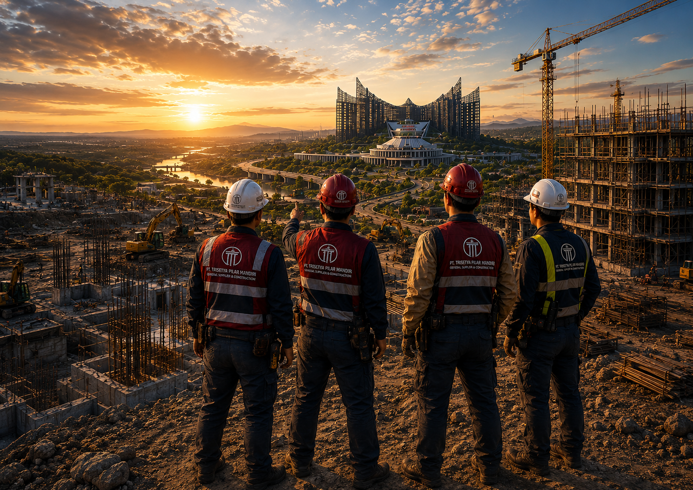

<html lang="id">
<head>
  <meta charset="UTF-8" />
  <meta name="viewport" content="width=device-width, initial-scale=1.0"/>
  <title>Recruitment IKN - PT. Trisetya Pilar Mandiri</title>

  <link href="https://fonts.googleapis.com/css2?family=Poppins:wght@300;400;500;600;700;800&display=swap" rel="stylesheet">

  
</head>

<body>

  

    

      

        
		

        

		

          MEMBANGUN MASA DEPAN UNTUK INDONESIA
        

        <h1>
          BERGABUNGLAH 
          BERSAMA KAMI
        </h1>

        

          Rekrutmen Proyek Pembangunan Ibu Kota Nusantara (IKN)
        

        

          PT. Trisetya Pilar Mandiri membuka kesempatan bagi para profesional
          dan pekerja terampil untuk bergabung dalam proyek strategis nasional
          pembangunan Ibu Kota Nusantara.
        

      

          

        
      

    

      <h2>Posisi Yang Dibutuhkan</h2>

      

        
01. Helper

        
02. Tukang Besi / Rebarman

        
03. Tukang Concrete

        
04. Tukang Kayu / Carpenter

        
05. Scaffolder

        
06. Driver LV

        
07. Operator Excavator

        
08. Operator Trailer

        
09. Operator Truck Crane

        
10. Operator Crawler Crane

        
11. Electrical

        
12. Welder Stik

        
13. Welder CO

        
14. GTAW

        
15. Fitter 2

        
16. Cleaner

        
17. Security

        
18. Safety

      

    

    

      <h2>Kualifikasi Umum</h2>

      <ul class="qualification">
        <li>Pendidikan minimal SMP/SMA/SMK sesuai posisi</li>
        <li>Berpengalaman di bidang konstruksi minimal 1-2 tahun</li>
        <li>Mampu bekerja dalam tim dan target</li>
        <li>Disiplin, bertanggung jawab dan profesional</li>
        <li>Bersedia ditempatkan di lokasi proyek IKN</li>
      </ul>

    

    

      <h2>Apa Yang Kami Tawarkan</h2>

      

        
Proyek Strategis Nasional

        
Kesempatan Berkembang

        
Gaji Kompetitif

        
Lingkungan Kerja Profesional

        
Jenjang Karir Terbuka

      

    

    

      

        <h2>Kirimkan CV & Lamaran Anda</h2>

        
📧 trisetyapilarmandiri@gmail.com

        

          Subject :
          Nama_Posisi yang dilamar
        

         

        <a href="https://forms.gle/b3PoEgiW7BUq7Nwd8"
           target="_blank"
           class="btn">
           DAFTAR SEKARANG
        </a>

      

      

        

      

    

    <footer>
      “BERSAMA KITA BANGUN NEGERI, MENATA MASA DEPAN”
	</footer>

  

